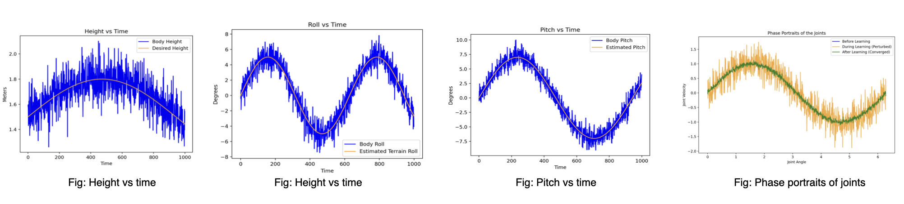
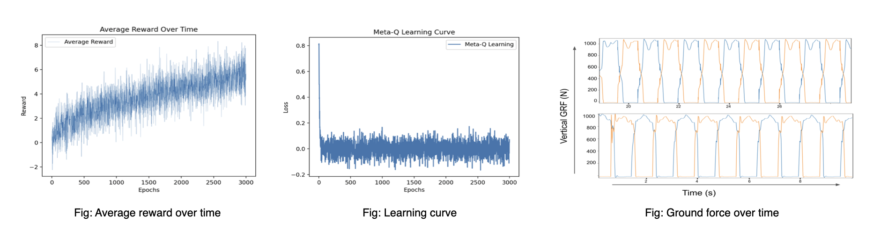

# meta-qlearning-humanoid
Meta QLearning Experiments to optimize robot walking patterns 


# Overview:
Implemented Meta-Q-Learning for optimizing humanoid walking patterns. We also demonstrate its effectiveness in improving stability, efficiency, and adaptability. Additionally, this work also explores the transferability of Meta-Q-Learning to new tasks with minimal tuning. 

## Conducted experiments:
### Learn Stepping using MQL
Test how adaptable the humanoid is by performing:
- Side stepping
- Ascending and Descending

## Setting up the environment:
This repository contains everything needed to set up the environment and get the simulation up and running. 

### Clone the repository: 
`git clone git@github.com:gokulp01/meta-qlearning-humanoid.git`
Make sure the file structure is as follows:
```
<Your folder>
├── algs
│   └── MQL
│       ├── buffer.py
│       └── mql.py
├── configs
│   └── abl_envs.json
├── Humanoid_environment
│   ├── envs
│   │   ├── common
│   │   └── jvrc
│   ├── models
│   │   ├── cassie_mj_description
│   │   └── jvrc_mj_description
│   ├── scripts
│   │   ├── debug_stepper.py
│   │   └── plot_logs.py
│   ├── tasks
│   │   │   ├── rewards.cpython-37.pyc
│   │   │   ├── stepping_task.cpython-37.pyc
│   │   │   └── walking_task.cpython-37.pyc
│   │   ├── rewards.py
│   │   ├── stepping_task.py
│   │   └── walking_task.py
│   └── utils
│       └── footstep_plans.txt
├── misc
│   ├── env_meta.py
│   ├── logger.py
│   ├── runner_meta_offpolicy.py
│   ├── runner_multi_snapshot.py
│   ├── torch_utility.py
│   └── utils.py
├── models
│   ├── networks.py
│   └── run.py
├── README.md
└── run_script.py
```

### Installing packages:
```
pip3 install -r requirements.txt
```

### Training
```
python3 run_script.py
```

### Inference
This work was done as a fun project to learn RL and its applications, so I have not drawn a lot of theoretical inferences. That being said, here are some quantitative inferences from the work:




## References:
Rasool Fakoor, Pratik Chaudhari, Stefano Soatto, & Alex Smola (2020). Meta-Q-Learning. In ICLR 2020, Microsoft Research Reinforcement Learning Day 2021


### Some important notes:
- Code is written to train using a GPU
- Training time: ~55 hours on RTX 3080
- **Feel free to contact the author for pre-trained model**
- The code is not very well documented (PRs are more than welcome!)
